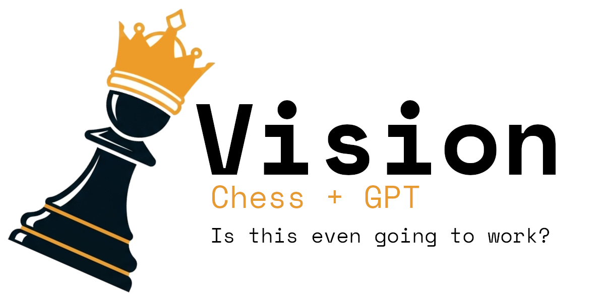

</img>

## About
Vision is a small in-progress model designed to predict the next move in a chess game using a Transformer model. Most importantly the end goal is to train a bot that plays convincingly like a human.

It's a hobby project and thus far this method is unproven. For more proven neural network architectures check out [pytorch-nnue](https://official-stockfish.github.io/docs/nnue-pytorch-wiki/docs/nnue.html).

## Prerequisites
Before you proceed make sure you have [poetry installed](https://python-poetry.org/docs/#installation).

You might also want to get some PGN files, [lichess provides monthly snapshots](https://database.lichess.org/).

These snapshots are quite large (~200GB per month uncompressed) so you may want a tool like [pgn-extract](https://www.cs.kent.ac.uk/people/staff/djb/pgn-extract/). It's very fast and very helpful for filtering these files. Here's a [blog](https://bigeatie.com/posts/pgn-extract/) showing some usage examples for pgn-extract. 

## Setup
Setup is simple:

```bash
poetry install
```

## Usage
1. You'll need to get some pgn files and place them in a folder (ex. `data/pgn`)

    ```bash
    mkdir -p data/pgn && mkdir -p data/training && mkdir -p data/validation
    ```
    (Note: You can place the pgn files where you want but the next step expects there to be a `training` and `validation` directory within the output directory you specify)

2. Then process these into numpy arrays using `pgn_to_npy.py`. This example uses `poetry` but use whichever package/environment manager you like.

    ```bash
    $(poetry env activate)
    python vision/pgn_to_npy.py --input ./data/pgn --output-dir ./data
    ```
    (Note: The search for PGN files isn't recursive, it will only look at the top level of the directory. There is also no progress output just yet.)
    

3. Then run the model, you can also adjust most hyperparameters in `config.yaml`

    ```bash
    python vision/main.py
    ```

4. The model will run and automatically save any epochs that perform better than the last best epoch. You should see [pytorch-lightning](https://lightning.ai/) output like:

    ```text
    | Name                 | Type       | Params | Mode 
    ------------------------------------------------------------
    0 | token_embedding      | Embedding  | 2.1 M  | train
    1 | positional_embedding | Embedding  | 25.6 K | train
    2 | transformer_blocks   | ModuleList | 4.2 M  | train
    3 | final_norm           | RMSNorm    | 512    | train
    4 | out_head             | Linear     | 2.1 M  | train
    ------------------------------------------------------------
    8.4 M     Trainable params
    0         Non-trainable params
    8.4 M     Total params
    33.711    Total estimated model params size (MB)
    21        Modules in train mode
    0         Modules in eval mode
    Sanity Checking: |            | 0/? [00:00<?, ?it/s]
    Epoch 0: 100%|████████████| 11391/11391 [1:21:14<00:00,  2.34it/s, v_num=30, train_loss_step=0.707, train_perplexity_step=2.030, val_accuracy_step=0.983]
    ```

## Rationale
LLMs are mostly produced with autoregressive transformer models but transformers are not LLMs. Transformer models simply take a current state of tokens and produce the next most likely token in the series. It's at least possible that these models would apply to predicted other ordered sequences when those sequences have relationships between each other.

## But Why?
This is mostly a learning exercise for me. I don't know enough about every type of machine learning model and I've intentionally avoided learning about chess-related models for the time being so that I can focus on transformer models. To the best of my knowledge LLMs with chess haven't been explored yet beyond trying to get ChatGPT to play chess and I thought it would be fun to explore the possibility of more practical applications.

## Performance
Further improvements and bugfixes to the model suggest that with enough training data, a large enough model, and a robust tokenization scheme (still experimenting) it may learn to generalize well.

### Loss


### Accuracy


# Caveats / Limitations

The current tokenization scheme is based on UCI move instructions from the start of a standard chess game. As such it likely won't be any good at playing Chess variants like Chess960. This tokenization scheme also makes dropout ineffective. It may change in the future as the model evolves.